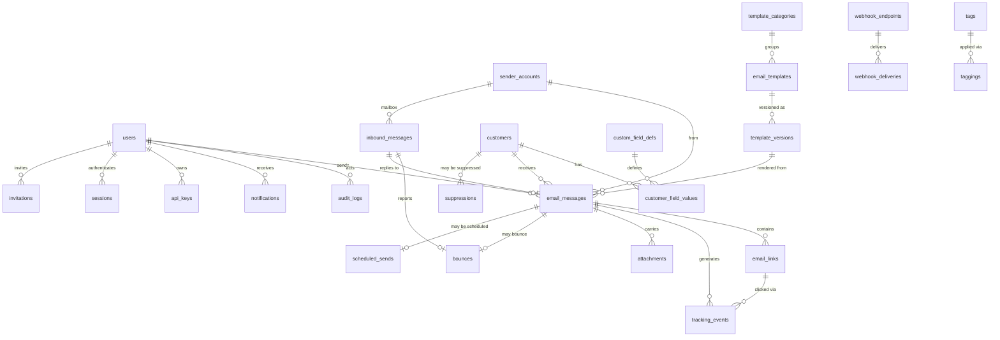

# Entity-Relationship Design (ERD)

## Email Engagement & Tracking Platform — Database Design

| | |
|---|---|
| **Document version** | 1.0 |
| **Database** | PostgreSQL 16 |
| **Related docs** | [PRD.md](./PRD.md) · [TASKS.md](./TASKS.md) |

Conventions: all tables have `id UUID PK DEFAULT gen_random_uuid()`,
`created_at timestamptz DEFAULT now()`, and `updated_at timestamptz` (maintained
by trigger) unless noted. Soft deletes (`deleted_at`) on user-managed content
(templates, customers); hard immutability on event/audit tables.

---

## 1. ER diagram

---

## 2. Tables

### 2.1 Identity & access

#### `users`
| Column | Type | Notes |
|---|---|---|
| id | uuid PK | |
| email | citext UNIQUE NOT NULL | login |
| name | text NOT NULL | |
| password_hash | text NOT NULL | argon2id |
| role | enum `user_role` (admin, manager, agent, viewer) | RBAC per PRD §1.5 |
| totp_secret_enc | text NULL | optional 2FA, encrypted |
| notification_prefs | jsonb DEFAULT '{}' | per-event on/off, channel |
| theme | enum (system, light, dark) | dark mode pref |
| is_active | boolean DEFAULT true | |
| last_login_at | timestamptz | |

#### `api_keys`
| Column | Type | Notes |
|---|---|---|
| id | uuid PK | |
| user_id | uuid FK→users | key acts as this user |
| name | text | label |
| key_hash | text UNIQUE | SHA-256 of secret; secret shown once |
| scopes | text[] | e.g. `{send, read:analytics}` |
| last_used_at | timestamptz | |
| expires_at / revoked_at | timestamptz NULL | |

#### `sessions`
| Column | Type | Notes |
|---|---|---|
| id | uuid PK | |
| user_id | uuid FK→users, ON DELETE CASCADE | |
| refresh_token_hash | text UNIQUE NOT NULL | SHA-256 of the refresh token; rotated on every `/auth/refresh` |
| user_agent / ip | text / inet NULL | request metadata at issuance |
| expires_at | timestamptz NOT NULL | |
| revoked_at | timestamptz NULL | set on logout or rotation |

#### `invitations`
| Column | Type | Notes |
|---|---|---|
| id | uuid PK | |
| email | citext NOT NULL | not unique — a prior revoked/expired invite can be re-sent |
| name | text NOT NULL | pre-fills the new user's name |
| role | enum `user_role` DEFAULT 'agent' | assigned on acceptance |
| token_hash | text UNIQUE NOT NULL | SHA-256 of the invite token |
| invited_by | uuid FK→users NOT NULL | |
| expires_at | timestamptz NOT NULL | default 72h, `INVITATION_TTL_HOURS` |
| accepted_at / revoked_at | timestamptz NULL | partial unique index enforces one pending invite per email |

#### `audit_logs` *(append-only, no updated_at)*
| Column | Type | Notes |
|---|---|---|
| id | bigint identity PK | |
| user_id | uuid FK→users NULL | null = system |
| action | text NOT NULL | e.g. `template.update`, `send.override_suppression` |
| entity_type / entity_id | text / uuid | polymorphic target |
| metadata | jsonb | diff/context |
| ip | inet | |
| created_at | timestamptz | index (user_id, created_at desc) |

### 2.2 Sending infrastructure

#### `sender_accounts`
| Column | Type | Notes |
|---|---|---|
| id | uuid PK | |
| email | citext UNIQUE NOT NULL | e.g. sales@company.com |
| display_name | text | From name |
| smtp_host / smtp_port | text / int | default smtp.zoho.com / 465 |
| imap_host / imap_port | text / int | default imap.zoho.com / 993 |
| credential_enc | bytea NOT NULL | AES-256-GCM app password envelope |
| signature_html | text | appended on compose |
| daily_quota / hourly_quota | int | enforced by send worker |
| status | enum (active, disabled, auth_failed) | |
| last_verified_at | timestamptz | connection test |
| imap_last_uid | bigint | inbound sync cursor |

### 2.3 Customers

#### `customers`
| Column | Type | Notes |
|---|---|---|
| id | uuid PK | |
| name | text NOT NULL | |
| company | text | |
| email | citext NOT NULL UNIQUE (where deleted_at is null) | |
| phone | text | |
| notes | text | |
| tracking_opt_out | boolean DEFAULT false | GDPR objection → no pixel/rewrite |
| engagement_score | int DEFAULT 0 | maintained by rollup job |
| deleted_at | timestamptz NULL | soft delete; erasure job hard-deletes |

#### `custom_field_defs`
| Column | Type | Notes |
|---|---|---|
| id | uuid PK | |
| key | text UNIQUE | merge-field name, e.g. `gst_number` |
| label | text | UI label |
| field_type | enum (text, number, date, url) | validation |

#### `customer_field_values`
| Column | Type | Notes |
|---|---|---|
| customer_id | uuid FK→customers | PK part |
| field_def_id | uuid FK→custom_field_defs | PK part |
| value | text | typed-validated on write |

### 2.4 Templates

#### `template_categories`
| Column | Type | Notes |
|---|---|---|
| id | uuid PK | |
| name | text UNIQUE | Quotation, Follow-up, Invoice, … (seeded, user-extensible) |
| default_template_id | uuid FK→email_templates NULL | FR-3.5 |

#### `email_templates`
| Column | Type | Notes |
|---|---|---|
| id | uuid PK | |
| category_id | uuid FK→template_categories | |
| name | text NOT NULL | |
| status | enum (draft, active, archived) | |
| current_version_id | uuid FK→template_versions | head pointer |
| created_by | uuid FK→users | |
| deleted_at | timestamptz NULL | |

#### `template_versions` *(immutable snapshots)*
| Column | Type | Notes |
|---|---|---|
| id | uuid PK | |
| template_id | uuid FK→email_templates | |
| version_no | int | (template_id, version_no) UNIQUE |
| subject | text NOT NULL | may contain merge fields |
| body_html | text NOT NULL | sanitized |
| body_text | text | plain-text alternative |
| placeholders | text[] | extracted at save for validation |
| created_by | uuid FK→users | |

### 2.5 Messages (central fact table)

#### `email_messages` — one row per recipient per send
| Column | Type | Notes |
|---|---|---|
| id | uuid PK | |
| public_token | text UNIQUE NOT NULL | 128-bit base62 — pixel/unsubscribe token |
| sender_account_id | uuid FK→sender_accounts | |
| customer_id | uuid FK→customers | |
| template_version_id | uuid FK→template_versions NULL | null = ad-hoc compose |
| sent_by | uuid FK→users | |
| to_email / to_name | citext / text | snapshot at send time |
| subject | text | merged subject |
| body_html_rendered | text | final merged+tracked HTML snapshot |
| body_text_rendered | text | |
| message_id_header | text UNIQUE | RFC 5322 Message-ID → bounce/reply correlation |
| tracking_enabled | boolean | FR-4.3 |
| status | enum `message_status` (draft, queued, scheduled, sending, sent, delivered, bounced, failed, cancelled) | state machine PRD §2.5 |
| smtp_response | text | 250 line or error |
| queued_at / sent_at | timestamptz | |
| **Denormalized engagement counters** | | *(source of truth = tracking_events)* |
| open_count / unique_open_hint | int / boolean | |
| first_opened_at / last_opened_at | timestamptz | |
| click_count | int | |
| first_clicked_at / last_clicked_at | timestamptz | |
| replied_at | timestamptz NULL | |
| bounce_type | enum (none, hard, soft) DEFAULT none | |
| unsubscribed_at | timestamptz NULL | this message triggered it |

Indexes: (sender_account_id, sent_at desc), (customer_id, sent_at desc),
(status), (template_version_id), GIN trigram on (to_email, subject) for search.

#### `email_links` — rewritten links per message
| Column | Type | Notes |
|---|---|---|
| id | uuid PK | |
| message_id | uuid FK→email_messages | |
| token | text UNIQUE NOT NULL | click-URL token |
| original_url | text NOT NULL | 302 target — only value ever redirected to |
| link_label | text | anchor text |
| position | int | order in body |
| click_count | int DEFAULT 0 | denormalized |

#### `attachments`
| Column | Type | Notes |
|---|---|---|
| id | uuid PK | |
| message_id | uuid FK→email_messages | |
| filename / content_type / size_bytes | text / text / bigint | |
| storage_path | text | local disk or S3-compatible |

#### `scheduled_sends`
| Column | Type | Notes |
|---|---|---|
| id | uuid PK | |
| message_id | uuid FK→email_messages UNIQUE | message in `scheduled` status |
| scheduled_for | timestamptz NOT NULL | |
| timezone | text | display |
| job_id | text | BullMQ delayed-job ref |
| cancelled_at | timestamptz NULL | |

### 2.6 Tracking events

#### `tracking_events` *(append-only; PARTITION BY RANGE (occurred_at), monthly)*
| Column | Type | Notes |
|---|---|---|
| id | bigint identity | PK with occurred_at |
| message_id | uuid FK→email_messages NOT NULL | |
| link_id | uuid FK→email_links NULL | set for clicks |
| event_type | enum `event_type` (open, open_inferred, click, bounce, reply, unsubscribe, spam_report) | |
| occurred_at | timestamptz NOT NULL | partition key |
| ip | inet NULL | truncated/hashed after retention window |
| user_agent | text | raw UA |
| device_type / os / browser | text | parsed from UA |
| geo_country / geo_city | text | GeoLite2, coarse |
| is_bot | boolean DEFAULT false | scanner heuristics PRD §2.2 |
| is_proxy | boolean DEFAULT false | Apple MPP / Gmail proxy detected |
| metadata | jsonb | anything extra |

Indexes per partition: (message_id, occurred_at), (event_type, occurred_at),
(link_id) where link_id is not null.

#### `daily_stats` *(rollup for fast analytics — rebuilt incrementally)*
| Column | Type | Notes |
|---|---|---|
| day | date | PK part |
| sender_account_id | uuid NULL | PK part (null = all) |
| template_id | uuid NULL | PK part (null = all) |
| sent / delivered / bounced_hard / bounced_soft | int | |
| opens_total / opens_unique | int | unique = distinct messages opened |
| clicks_total / clicks_unique | int | |
| replies / unsubscribes | int | |

### 2.7 Inbound processing

#### `inbound_messages` — raw IMAP intake (bounces, replies)
| Column | Type | Notes |
|---|---|---|
| id | uuid PK | |
| sender_account_id | uuid FK→sender_accounts | mailbox it arrived in |
| imap_uid | bigint | (sender_account_id, imap_uid) UNIQUE — idempotent sync |
| message_id_header | text | |
| in_reply_to / references_header | text | reply correlation |
| from_email / subject | citext / text | |
| received_at | timestamptz | |
| classification | enum (bounce_dsn, reply, other) | |
| matched_message_id | uuid FK→email_messages NULL | correlation result |
| raw_headers | jsonb | for audit/debug |

#### `bounces`
| Column | Type | Notes |
|---|---|---|
| id | uuid PK | |
| message_id | uuid FK→email_messages UNIQUE | |
| inbound_message_id | uuid FK→inbound_messages | the NDR |
| bounce_class | enum (hard, soft) | RFC 3463 mapping |
| status_code | text | e.g. `5.1.1` |
| diagnostic | text | remote server text |
| bounced_at | timestamptz | |

### 2.8 Compliance

#### `suppressions`
| Column | Type | Notes |
|---|---|---|
| id | uuid PK | |
| email | citext UNIQUE NOT NULL | may exist without a customer row |
| customer_id | uuid FK→customers NULL | |
| reason | enum (hard_bounce, soft_bounce_repeat, unsubscribe, manual, spam_report) | |
| source_message_id | uuid FK→email_messages NULL | |
| suppressed_at | timestamptz | |
| released_at / released_by | timestamptz / uuid NULL | admin override, audit-logged |

### 2.9 Platform

#### `tags` / `taggings`
`tags(id, name UNIQUE, color)`;
`taggings(tag_id FK, entity_type enum(customer, message, template), entity_id uuid)` —
PK (tag_id, entity_type, entity_id).

#### `notifications`
| Column | Type | Notes |
|---|---|---|
| id | uuid PK | |
| user_id | uuid FK→users | |
| type | enum (first_open, click, reply, bounce, send_failed, quota_warning) | |
| message_id | uuid FK→email_messages NULL | |
| title / body | text | |
| read_at | timestamptz NULL | |

#### `webhook_endpoints`
| Column | Type | Notes |
|---|---|---|
| id | uuid PK | |
| url | text NOT NULL | HTTPS only |
| secret_enc | bytea | HMAC-SHA256 signing key |
| events | text[] | subscribed event types |
| is_active | boolean | auto-disabled after N consecutive failures |

#### `webhook_deliveries` *(append-only)*
`id, endpoint_id FK, event_type, payload jsonb, attempt int, response_status int,
delivered_at, next_retry_at` — retries with backoff, max 5.

#### `settings`
`key text PK, value jsonb` — retention windows, tracking domain, physical
address for CAN-SPAM footer, feature flags.

---

## 3. Key design decisions

1. **`email_messages` as the fact table with denormalized counters.** The sent-mail
   list (the most-viewed screen) never joins the event table. Counters are updated
   in the same transaction as event insertion; `tracking_events` remains the
   auditable source of truth, so counters can always be rebuilt.
2. **Rendered-body snapshots on the message.** Template edits never change what
   a sent email "was"; message detail shows exactly what the customer received.
   Template analytics attribute via immutable `template_versions`.
3. **Monthly partitioning of `tracking_events`** keeps writes fast and lets the
   retention job drop old partitions cheaply (GDPR data-minimization). The
   `daily_stats` rollup preserves aggregates after raw events are purged.
4. **Tokens live where they're resolved**: message-level `public_token` (pixel,
   unsubscribe) and per-link `token`. Both indexed unique; hot lookups cached in
   Redis with short TTL.
5. **Suppression keyed by email, not customer**, so a bounced address stays
   suppressed even if the customer record is deleted/re-imported.
6. **Idempotent IMAP sync** via (account, UID) uniqueness — reprocessing a
   mailbox can never double-record a bounce or reply.
7. **`citext` for all email columns** — case-insensitive matching everywhere
   (bounce correlation, suppression checks, search).
